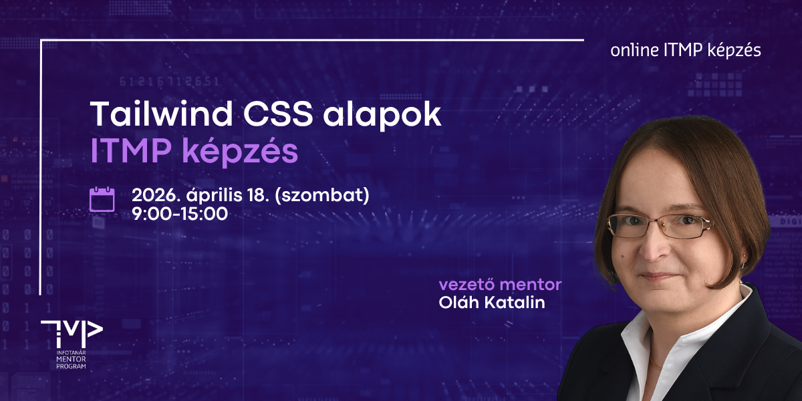

# Tailwind CSS alapok
## ITMP Klub képzés infotanároknak

Az egynapos, Tailwind CSS alapú frontend fejlesztési képzésen a modern, utility-first szemléletű CSS keretrendszer segítségével hatékonyan és gyorsan építhetsz letisztult, reszponzív felületeket.

A képzés során Oláh Katalin vezető mentor segítségével lépésről lépésre ismerkedhetsz meg a Tailwind működésével. Közösen indítjuk el az első projektedet Vite használatával, miközben megtanulod a utility classok tudatos és hatékony alkalmazását.

**A továbbképzés időpontja:** 2026. április 18. (szombat) 9:00-15:00

**A továbbképzés formája:** online (Microsoft Teams meeting)

**A képzés tervezett tematikája és ütemezése:**

| Időpont           |Téma                                                              |
|-------------------|------------------------------------------------------------------|
| *09:00 - 09:15*   | *Köszöntő, technikai információk*                                |
| **09:15 - 10:45** | **1. modul – Tailwind projekt, alapvető UI formázások**          |
| 09:15 - 09:45     | 1. modul elméleti áttekintés - Oláh Katalin                      |
| 09:45 - 10:45     | 1. modul workshop - kiscsoportos, mentorált gyakorlat            |
| _10:45 - 11:00_   | _Kávészünet_                                                     |
| **11:00 - 12:30** | **2. modul - Reszponzív webdesign és modern Layout rendszerek**  |
| 11:00 - 11:30     | 2. modul elméleti áttekintés és demó - Oláh Katalin              |
| 11:30 - 12:30     | 2. modul workshop - kiscsoportos, mentorált gyakorlat            |
| _12:30 - 13:30_   | _Ebédszünet_                                                     |
| **13:30 - 14:45** | **3. modul - Dark Mode és felhasználói interakciók**             |
| 13:30 - 14:00     | 3. modul elméleti áttekintés és demó - Oláh Katalin              |
| 14:00 - 14:45     | 3. modul workshop - kiscsoportos, mentorált gyakorlat            |
| _14:45 - 15:00_   | _Kérdések és válaszok, napzárás_                                 |

